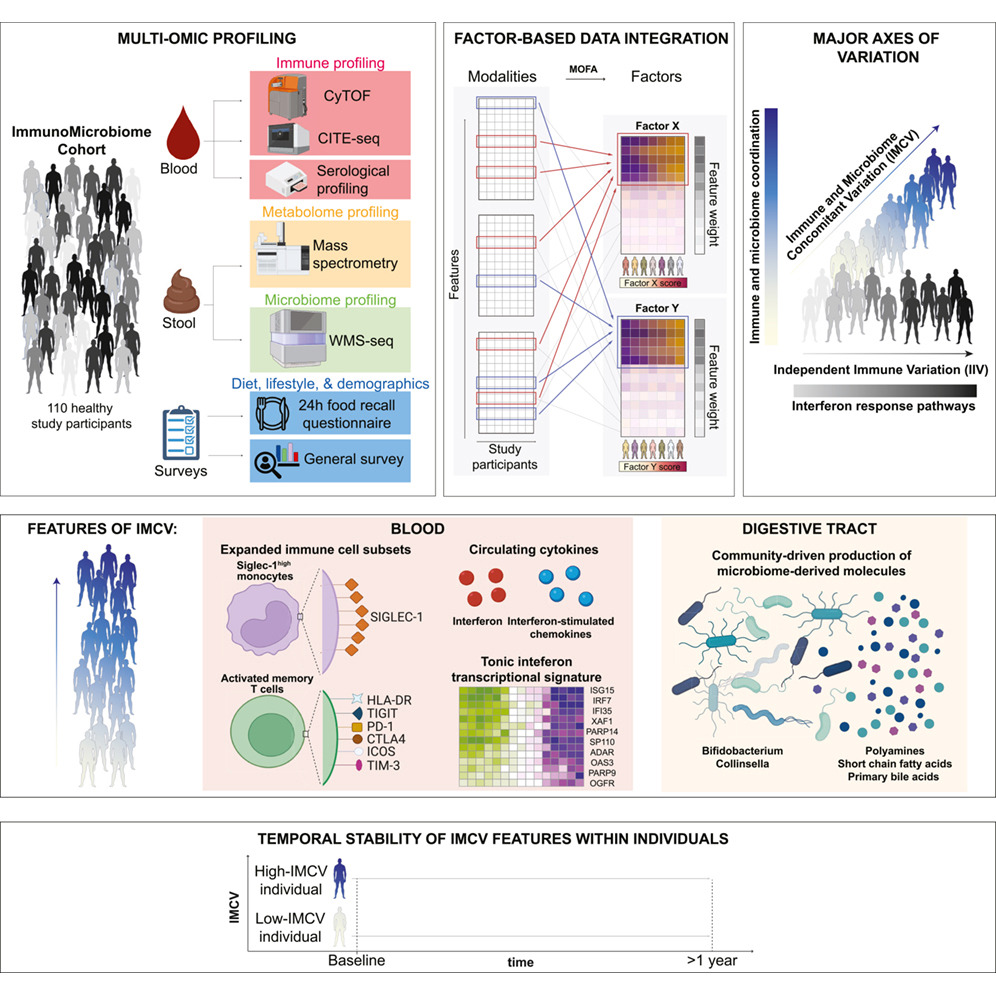

# Immune-microbiome coordination defines interferon setpoints in healthy humans

This repository consists of software code and data used for the analysis, figures and tables published in the article:


Joel Babdor, Ravi K. Patel, Brittany Davidson, Kelvin Koser, Cecilia Noecker, Maha K. Rahim, Jordan E. Bisanz, Iliana Tenvooren, Diana Marquez, Maria Calvo, Vrinda Johri, Elizabeth E. McCarthy, Avneet Shaheed, Christina Ekstrand, Allison M. Weakley, Feiqiao B. Yu, Kristen Krip, Kashif A. Shaikh, Hajera Amatullah, Oliver Fiehn, Peter J. Turnbaugh, Alexis J. Combes, Gabriela K. Fragiadakis, Matthew H. Spitzer **"Immune-microbiome coordination defines interferon setpoints in healthy humans"**. Cell (2026)
https://www.cell.com/cell/fulltext/S0092-8674(26)00168-6

### Description of code
```
src/ (Data analysis code)
└── R
    ├── CITEseq (CITEseq data analysis: data normalization, batch-correction, GEX-ADT integration, cell clustering, annotation, and pseudobulk gene expression)
    ├── cytof (CyTOF data analysis: data normalization, batch-correction, and cell clustering)
    ├── integrative_analysis (Integrative analysis)
    │   ├── data_preprocessing (Preprocessing of individual modality from baseline and follow-up visit data)
    │   ├── dge_analysis (Differential gene expression analysis comparing high and low IMCV and IIV subgroups)
    |   ├── functions_chunk.R (R functions used by other scripts)
    │   ├── mofa.Rmd (Data preparation and integrative analysis)
    │   └── mofa_downstream_analysis.Rmd (MOFA factor interpretation and analysis)
    ├── mapping_citeSeq_longitudinal_to_baseline (Mapping CITEseq data from follow-up visit to baseline data)
    ├── followup_data_analysis (Downstream analysis of baseline and follow-up visit data)
    └── variation_analysis (Immune and microbiome variation analysis)
```

### Data availability
- Processed data matrices, MOFA model, and factor interpretation results on Zenodo (https://zenodo.org/records/19029108)
- CITEseq raw sequencing data and count matrix are available at GEO: GSE314416 (https://www.ncbi.nlm.nih.gov/geo/query/acc.cgi?acc=GSE314416)
- Bulk RNA sequencing data GEO: GSE314922 (https://www.ncbi.nlm.nih.gov/geo/query/acc.cgi?acc=GSE314922)
- Whole metagenome sequencing data BioProject: PRJNA1390888 (https://www.ncbi.nlm.nih.gov/bioproject/PRJNA1390888) / SRA: SRP656586 (https://www.ncbi.nlm.nih.gov/sra/?term=SRP656586)


### Disclaimer
This open source software comes as is with absolutely no warranty.

NOTE: HS99 and HS109 correspond to the same participant; measurements associated with the identifier HS109 were used for this participant.
